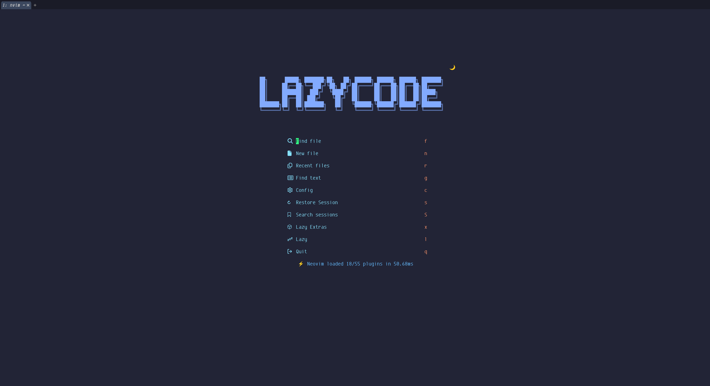

# 🌙 NVIMforZERO

🚕🚕🚕Sometimes configuration is too tricky for me to deal with, but once I configure these coding tools successfully, including neovim, I would feel a great ammount of happiness and be eager to practice more.

🌙 Appearances:

